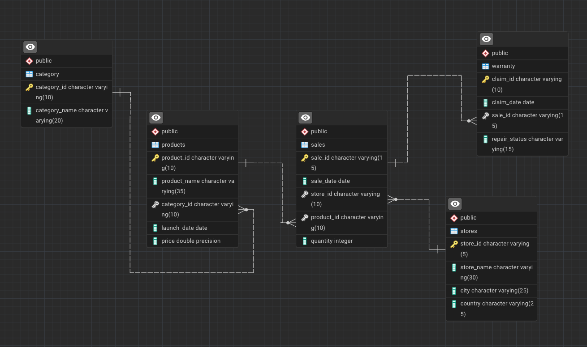

# Apple Retail Sales SQL Project - Analyzing Millions of Sales Rows
Project Category: Advanced
 

## Project Overview

This project demonstrates the application of advanced SQL querying skills by analyzing a large dataset of over 1 million rows of Apple retail sales data. The dataset encompasses a wide range of information, including details about products, stores, sales transactions, and warranty claims from Apple retail locations around the world. Through a series of progressively complex queries, this project showcases the ability to extract meaningful insights and solve data-related challenges, highlighting expertise in SQL and data manipulation.

## Entity Relationship Diagram (ERD)



## Database Schema

The project uses five main tables:

1. **stores**: Contains information about Apple retail stores.
   - `store_id`: Unique identifier for each store.
   - `store_name`: Name of the store.
   - `city`: City where the store is located.
   - `country`: Country of the store.

2. **category**: Holds product category information.
   - `category_id`: Unique identifier for each product category.
   - `category_name`: Name of the category.

3. **products**: Details about Apple products.
   - `product_id`: Unique identifier for each product.
   - `product_name`: Name of the product.
   - `category_id`: References the category table.
   - `launch_date`: Date when the product was launched.
   - `price`: Price of the product.

4. **sales**: Stores sales transactions.
   - `sale_id`: Unique identifier for each sale.
   - `sale_date`: Date of the sale.
   - `store_id`: References the store table.
   - `product_id`: References the product table.
   - `quantity`: Number of units sold.

5. **warranty**: Contains information about warranty claims.
   - `claim_id`: Unique identifier for each warranty claim.
   - `claim_date`: Date the claim was made.
   - `sale_id`: References the sales table.
   - `repair_status`: Status of the warranty claim (e.g., Paid Repaired, Warranty Void).

## Objectives

The project is split into three tiers of questions to test SQL skills of increasing complexity:

### Easy to Medium (10 Questions)

**1. Find the number of stores in each country.**
```
select country,
count(store_id) as 'Number_of_stores' 
from stores 
group by country;
```
**2. Calculate the total number of units sold by each store.**
```
select st.store_name,sum(sa.quantity) as 'Total_units'
from stores st
join sales sa
on sa.store_id=st.store_id
group by st.store_name;
```
**3. Identify how many sales occurred in December 2023.**
```
SELECT COUNT(*) AS total_sales
FROM sales
WHERE DATE_FORMAT(sale_date, '%Y-%m') = '2023-12';
```
**4. Determine how many stores have never had a warranty claim filed.**
```
select count(st.store_id) as 'Total_stores' 
from stores st 
where st.store_id not in 
(select distinct sa.store_id 
from sales sa 
join warranty w 
on sa.sale_id=w.sale_id);
```
**5. Calculate the percentage of warranty claims marked as "Warranty Void".**
```
select count(claim_id)/(select count(claim_id) from warranty)*100 as 'warranty_voif_percent' 
from warranty 
where repair_status='Warranty void';
```
**6. Identify which store had the highest total units sold in the last year.**
```
select st.store_name,sum(sa.quantity) as 'Total_units_sold' 
from stores st
join sales sa
on sa.store_id=st.store_id
where year(sa.sale_date)=Year(curdate())-1
group by st.store_name
order by Total_units_sold desc limit 1;
```
**7. Count the number of unique products sold in the last year.**
```
select p.product_name,
count(sa.product_id) as 'Total_unique_product'
from products p
join sales sa
on p.product_id=sa.product_id
where year(sa.sale_date)=Year(curdate())-1
group by p.product_name
order by Total_unique_product desc;
```
**8. Find the average price of products in each category.**
```
select c.category_name,
avg(p.price) as 'Average_price' 
from category c 
join products p 
on c.category_id=p.category_id
group by c.category_name;
```
**9. How many warranty claims were filed in 2020?**
```
select count(claim_id) as 'Total_claimed' 
from warranty 
where year(claim_date)=2020;
```
**10. For each store, identify the best-selling day based on highest quantity sold.**
```
With bestsellingday as (
select st.store_name,dayname(sa.sale_date) as 'Best_selling_day',sum(sa.quantity) as 'Total_units',
row_number() over(partition by st.store_name order by sum(sa.quantity) desc) as 'ranking'
from stores st
join sales sa
on sa.store_id=st.store_id
group by st.store_name,Best_selling_day
)
select b.store_name,b.Best_selling_day,b.Total_units from bestsellingday b where b.ranking=1;
```

### Medium to Hard (5 Questions)

**11. Identify the least selling product in each country for each year based on total units sold.**
```
With leastsellingproduct as (
select year(sa.sale_date) as 'sale_dates',
st.country,p.product_name,
sum(sa.quantity) as 'Total_units_sold',
dense_rank() over(partition by st.country,year(sa.sale_date) order by sum(sa.quantity) asc) as 'ranking'
from stores st
join sales sa
on sa.store_id=st.store_id
join products p 
on p.product_id=sa.product_id
group by sale_dates,st.country,p.product_name
)
select l.sale_dates,
l.country,
l.product_name,
l.Total_units_sold 
from leastsellingproduct l 
where l.ranking=1;
```
**12. Calculate how many warranty claims were filed within 180 days of a product sale.**
```
select * from sales limit 100;
select count(w.claim_id) as 'Total_claims'
from warranty w 
join sales sa
on sa.sale_id=w.sale_id
where w.claim_date-sa.sale_date<=180;
```
**13. Determine how many warranty claims were filed for products launched in the last two years.**
```
select p.product_name,
count(w.claim_id) as 'Total_claims'
from warranty w
join sales sa
on sa.sale_id=w.sale_id
join products p
on p.product_id=sa.product_id
where Year(p.launch_date)>=year(curdate())-2
group by p.product_name;
```
**14. List the months in the last three years where sales exceeded 5,000 units in the USA.**
```
select monthname(sa.sale_date) as 'Month',
sum(sa.quantity) as 'Total_units' 
from stores st 
join sales sa
on sa.store_id=st.store_id
where st.country='USA'
and sa.sale_date>=date_sub(curdate(),interval 3 year)
group by Month
having Total_units>5000
order by Total_units desc;
```
**15. Identify the product category with the most warranty claims filed in the last two years.**
```
select c.category_name,
w.claim_date,
count(w.claim_id) as 'Most_warranty_claims'
from warranty w
join sales sa
on sa.sale_id=w.sale_id
join products p 
on p.product_id=sa.product_id
join category c 
on c.category_id=p.category_id
where w.claim_date>=date_sub(curdate(),interval 2 year)
group by c.category_name,w.claim_date
order by Most_warranty_claims desc
limit 1;
```

### Complex (5 Questions)

**16. Determine the percentage chance of receiving warranty claims after each purchase for each country.**
```
select st.country,
count(w.claim_id) as 'Total_claims',
sum(sa.quantity) as 'total_units_sold',
round(count(w.claim_id)/sum(sa.quantity)*100,2) as 'risk_percentage'
from stores st 
join sales sa
on sa.store_id=st.store_id
left join warranty w 
on sa.sale_id=w.sale_id
group by st.country
order by risk_percentage desc;
```
**17. Analyze the year-by-year growth ratio for each store.**
```
With yearly_sales as (
select st.store_id,
st.store_name,
year(sale_date) as 'sale_year',
sum(sa.quantity) as 'total_units_sold'
from stores st
join sales sa
on sa.store_id=st.store_id
group by st.store_id,st.store_name,sale_year
),
growth_calc as (
select ys.store_id,
ys.store_name,
ys.sale_year,
ys.total_units_sold,
coalesce(lag(ys.total_units_sold) over(partition by ys.store_id order by ys.sale_year asc),0) as 'previous_year_sale'
from yearly_sales ys
)
select gc.store_id,
gc.store_name,
gc.sale_year,
gc.total_units_sold,
gc.previous_year_sale,
case
when gc.previous_year_sale=0 then 0
else round(((gc.total_units_sold-gc.previous_year_sale)/gc.previous_year_sale) * 100,2) 
end as 'growth percentage'
from growth_calc gc;
```
**18. Identify the store with the highest percentage of "Paid Repaired" claims relative to total claims filed.**
```
With paid_repair as (
select sa.store_id,
count(w.claim_id) as 'total_paid_repaired'
from sales sa
join warranty w 
on sa.sale_id=w.sale_id
where w.repair_status='Paid Repaired'
group by sa.store_id
),
total_paid_repaired as (
select sa.store_id,count(w.claim_id) as 'Total_repaired'
from sales sa
join warranty w
on sa.sale_id=w.sale_id
group by sa.store_id
)
select t.store_id,
st.store_name,
p.total_paid_repaired,
t.Total_repaired,
p.total_paid_repaired/t.Total_repaired*100 as 'percentage_paid_repaired'
from paid_repair p
join total_paid_repaired t
on p.store_id=t.store_id
join stores st
on st.store_id=t.store_id;
```
**19. Write a query to calculate the monthly running total of sales for each store over the past four years and compare trends during this period.**
```
With monthly_sales as (
select sa.store_id,
Year(sa.sale_date) as 'sales_year',
monthname(sa.sale_date) as 'Sales_month',
month(sa.sale_date) as 'month_num',
sum(sa.quantity*p.price) as 'Total_price'
from sales sa 
join products p
on p.product_id=sa.product_id
where sa.sale_date>=date_sub(curdate(),interval 4 year)
group by sa.store_id,sales_month,sales_year,month_num
)
select m.store_id,
m.sales_year,
m.Sales_month,
m.Total_price,
sum(m.Total_price) over(partition by m.store_id order by m.sales_year,m.month_num) as 'running_total_sales'
from monthly_sales m;
```
**20. Analyze product sales trends over time, segmented into key periods: from launch to 6 months, 6-12 months, 12-18 months, and beyond 18 months.**
```
select p.product_name,
case
when sa.sale_date between p.launch_date and date_add(p.launch_date,interval 6 month) then '0-6 month'
when sa.sale_date between date_add(p.launch_date,interval 6 month) and date_add(p.launch_date,interval 12 month) then '6-12 month'
when sa.sale_date between date_add(p.launch_date,interval 12 month) and date_add(p.launch_date,interval 18 month) then '12-18 month'
else 'beyond 18'
end as 'plc',
sum(sa.quantity) as 'Total_quantity'
from sales sa
join products p
on p.product_id=sa.product_id
group by p.product_name,plc
order by Total_quantity desc;
```

## Project Focus

This project primarily focuses on developing and showcasing the following SQL skills:

- **Complex Joins and Aggregations**: Demonstrating the ability to perform complex SQL joins and aggregate data meaningfully.
- **Window Functions**: Using advanced window functions for running totals, growth analysis, and time-based queries.
- **Data Segmentation**: Analyzing data across different time frames to gain insights into product performance.
- **Correlation Analysis**: Applying SQL functions to determine relationships between variables, such as product price and warranty claims.
- **Real-World Problem Solving**: Answering business-related questions that reflect real-world scenarios faced by data analysts.


## Dataset

- **Size**: 1 million+ rows of sales data.
- **Period Covered**: The data spans multiple years, allowing for long-term trend analysis.
- **Geographical Coverage**: Sales data from Apple stores across various countries.

## Conclusion

After completing this project, I have developed advanced SQL querying skills, enhanced my ability to handle large datasets, and gained practical experience in solving complex data analysis problems that are crucial for business decision-making. This project serves as a valuable addition to my portfolio, showcasing my SQL expertise to potential employers.

## How to Run the Project
1. Install MySQL and MySQLWorkbench.
2. Set up the database schema and tables using the provided normalization structure.
3. Import the .csv file into the table.
4. Execute SQL queries to solve the listed problems.

---
